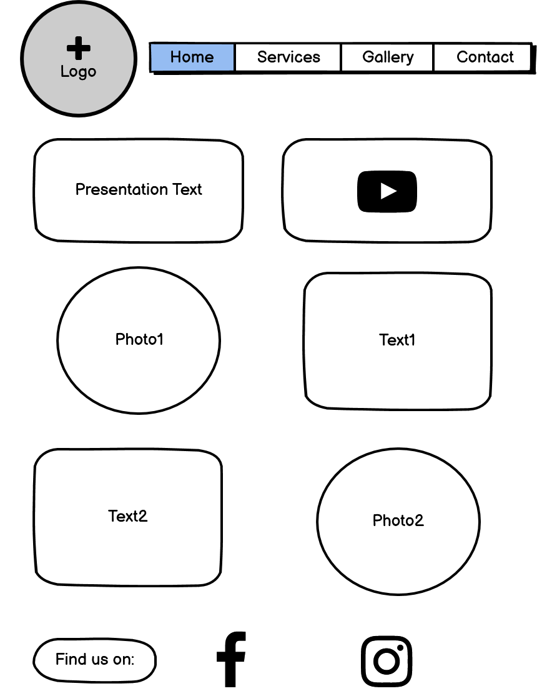
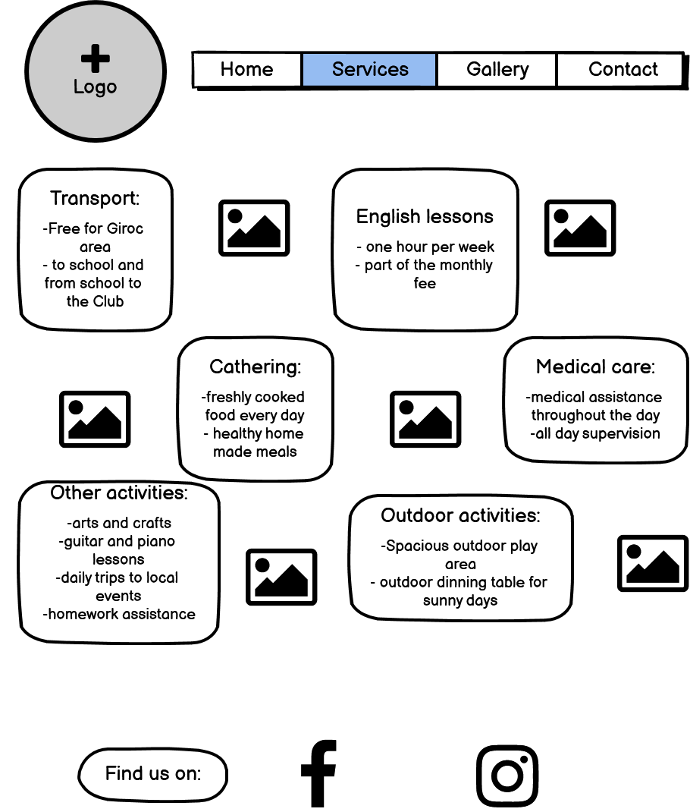
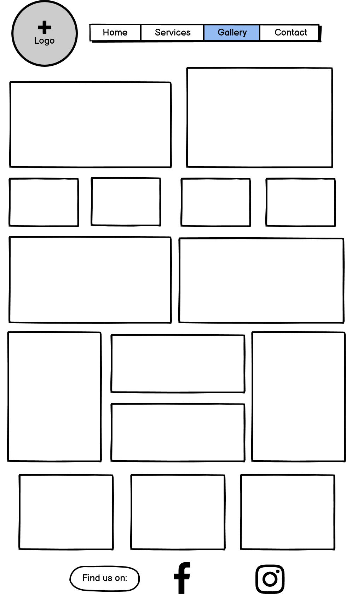
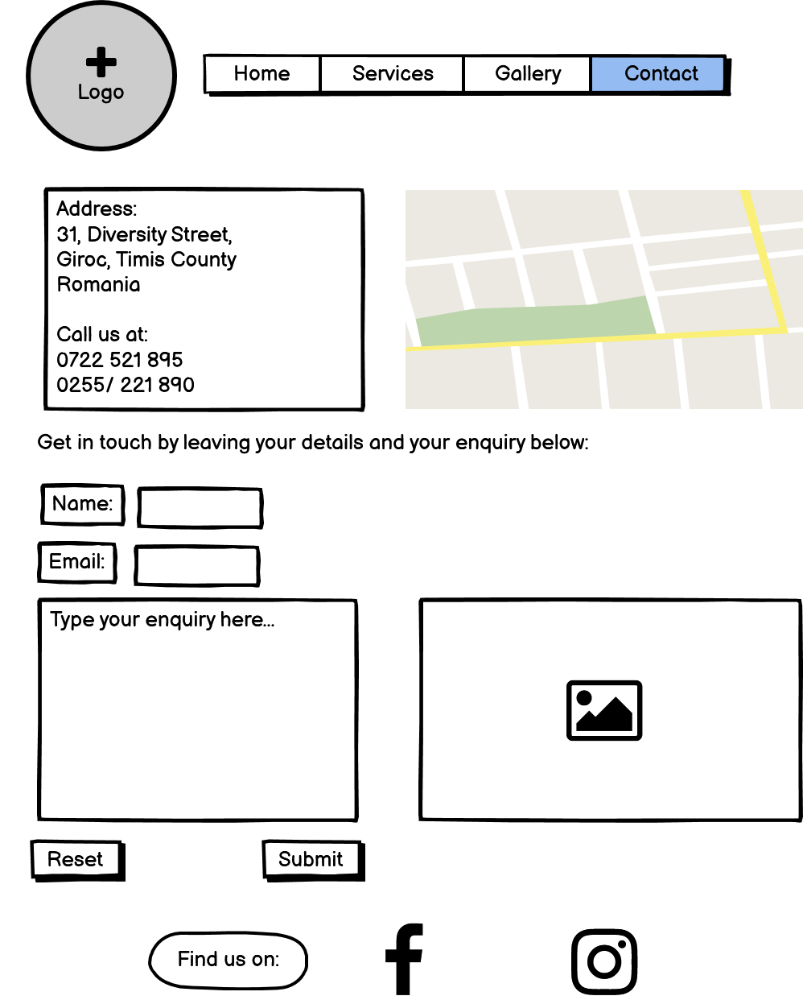
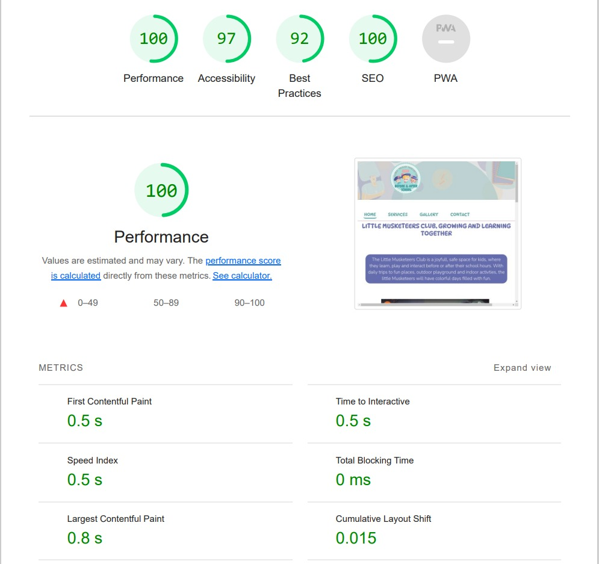

<h1>Little Musketeers Club</h1>
 
 
Little Musketeers Club is a page created for a before and after school which provides childcare services. The target audience of the site are parents and children who are looking for a space for the little ones to spend the afternoon hours. The site provides information on services, photos of the location, the activities and trips involved. It is a colorful, bubbly website that showcases perfectly the Little Musketeers Club.
 
 
<h2>UX Planes</h2>
 
<h3>Strategy</h3>
 
- Creating a page for parents to see and learn about the afterschool
- It brings value to the business, showcasing the location and the services it offer, also the elements making this business to stand out: free transport, cathering, different type of lessons, from english ones to learning to play a musical instrument
 
<h3>Scope</h3>
 
To provide value, it needs:
 
A. Visual content: a video presentation, photo gallery with different activities
 
B. Text: the language has to be friendly, catchy and joyfull
 
<h3>Structure</h3>
 
Navigation bar:
 
Home Page:
-presentation video
-a few general details about the afterschool, starting with the most attractive ones that makes the business stand out: free transport and generous opening hours
 
Services Page:
- detailed list of all the offers and activities
- each activity backed up with an appropiate image
 
Gallery Page:
- photos from the last couple of months of activity, trips, classes, crafts and outdoor fun in the garden, showcasing the space.
 
Contact Page:
- containing the location, address and contact details
- form for users to contact the afterschool with enquiries
- map to the exact location
- general photo, colorful and friendly.
 
<h3>Skeleton</h3>
- using Balsamiq Wireframes to map out the skeleton of all pages

 
<h2>Features</h2>

<h3>Existing Features</h3>
 
<h4>Navigation Bar</h4>
- It is featured on all 4 pages of the website, it is identical on all to allow easy navigation. It includes links to all pages, marking them active when lading on one of them, to keep track of the page the user is on.
- This will allow the user to navigate through the pages easily, without needing to use the "back" button of a browser.
 
<h4>First section</h4>
-Because the target audience are parents but also children, the first section of the Home page includes the presentation video of the Club.
- This will allow users to experience the location of the afterschool, as what the space has to offer is the decision-maker factor in many cases.
 
<h4>Second section</h4>
- This highlights a few of the services, the most improtant ones: a generous schedule, to cover most of the working hours of a job, and transportation, with option for collection and dropping of children to and from school. Also, the fact that the club has private transport ensured children can have daily trips to parks or in nature.
- The section keeps the tone of the site, bubbly and colorful.
- This section is valuble for the user as they will learn important information from the first page
 
<h4>The Footer</h4>
- This conains links to both of social media platforms for The Little Musketeers Club. The links open in a new tab to allow easy navigation for the user.
- The footer is valuble for the user as it encourages them to connect through social media, where all the latest news are being posted
 
<h4>Services</h4>
- This page displays detailed information of each service provided by the afterschool: from free transportation to food cathering, english classes and arts and crafts activities.
- This highlights all the features that the club offers, valuble information to help the user make a decision towards the Club's services
 
<h4>Gallery</h4>
- This page showcases the activities children can take part. It complements the Services page with visual content, also gives the user a better understanding of the programme the website offers.
<h4>Contact</h4>
- It offers information on the location, with the Google Maps feature, contact numbers and email address
- It includes a form for questions and enquiries, requiring the email and the text box to be filled before submitting.
 
<h3>Features left to implement</h3>
 
<h4>Registration form</h4>
- A form where users can register for the programme, with starting date, type of service(before-school or after-school), days of the week, with or without transport. This feature will also give the price at the end, depending on services selected
<h2>Testing</h2>
 
<h3>Validator testing</h3>
 
<h4>HTML</h4>
 
-No errors were returned when passing through the official W3C validator
 
<h4>CSS<h4>
 
-No errors were found when passing through the official (Jigsaw) validator
 
<h4>Accesibility</h4>
 
- I confirm that the colors and fonts chosen are easy to read and accesible by running it through lighthouse in devtools

<h2>Deployment</h2>
 
<h2>Credits</h2>
 
- My mentor Seun Owonikoko for introducing the flex display style and helping with the divs display
<h3>Content</h3>
 
- The icons in the footer were taken from Font Awesome
 
<h3>Media</h3>
 
- The video from Home page was created by Iulian Dobosan from Arts and Entertainment
- The images were provided by the Little Musketeers Club owners

